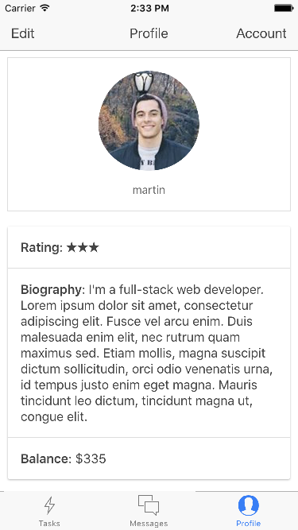

# Bolt - Work while you work

##About
### Bolt is a mobile and desktop application built during a 24-hour hackathon at the [2016 Emerge Americas Hackathon](http://emergeamericas.com/hackathon/) in Miami, FL.

## Screenshots

 

##Technologies
* Ionic

* AngularJS

* MongoDB

* Parse Server

##Open Source Parse Instance
https://github.com/totoromano/bolt-server

##Team Members
Adrian Rodriguez

Claudio Romano

Jaime Acevedo

Martin Di Diego
